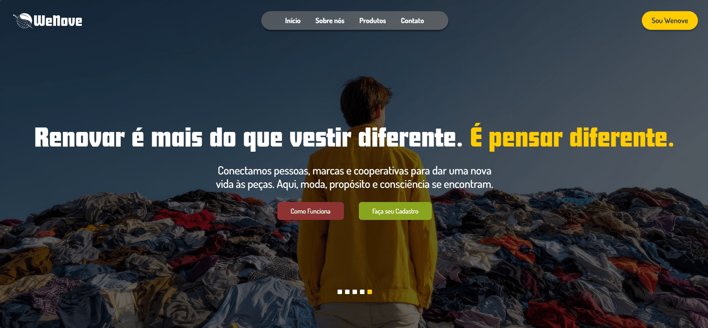

<h1 align="center">
  🌱 WeNove — Marketplace de Moda Sustentável
</h1>

<p align="center">
  
  
  
  
  
</p>

A **WeNove** é uma plataforma digital inovadora projetada como um marketplace de moda circular e sustentável. O projeto foi o **grande vencedor da competição Startup-se**, destacando-se por seu modelo de negócios escalável baseado puramente em tecnologia e conectividade local.

<p align="center">
  
</p>

---

## 📌 O Modelo de Negócios & Proposta de Valor

Diferente de brechós tradicionais que enfrentam gargalos com coletas físicas e logística pesada de estocagem, a WeNove atua estritamente como um **ecossistema integrador focado em tecnologia**. 

A plataforma resolve duas dores principais de mercado:
1. **Para os Lojistas/Brechós:** Oferece uma vitrine digital especializada, infraestrutura de catálogo otimizada e visibilidade direcionada para o público engajado em consumo consciente.
2. **Para os Consumidores:** Centraliza a busca por peças exclusivas de moda circular em uma interface moderna, intuitiva e confiável, promovendo a sustentabilidade urbana sem atritos operacionais.

---

## 📂 Estrutura do Projeto (Next.js App Router)

A arquitetura do repositório adota os padrões mais recentes do ecossistema React, garantindo modularidade e desacoplamento de código:

```text
WeNove
├── public/                 # Vetores estruturais (SVGs) e imagens do carrossel
├── src/
│   ├── app/                # Estrutura de rotas dinâmicas do App Router
│   │   ├── cadastro/       # Fluxo de onboarding de novos usuários
│   │   ├── criar-loja/     # Configuração e setup do espaço do vendedor
│   │   ├── login/          # Autenticação de acessos
│   │   ├── novo-produto/   # Painel de inserção e upload de novas peças
│   │   ├── produtos/       # Vitrine dinâmica e detalhes de itens por ID
│   │   └── sobre-nos/      # Manifesto institucional da marca
│   ├── components/         # Componentes globais de UI (Header, Footer, Filtros)
│   ├── contexts/           # Gerenciamento de estado global (UserContext)
│   └── lib/                # Funções utilitárias, mappers e engines de filtragem
├── components.json         # Configuração de tokens do Shadcn/ui
├── next.config.ts          # Definições de compilação do Next.js
└── package.json            # Manifest de dependências e scripts de execução

```

---

## 🛠️ Tecnologias e Arquitetura UI/UX

* **Next.js (App Router) & React 19:** Renderização eficiente, gerenciamento nativo de layouts e transições de páginas otimizadas.
* **TypeScript:** Tipagem estática robusta para contratos de produtos, perfis de usuários e propriedades de componentes.
* **Tailwind CSS & Shadcn/ui:** Design system moderno, totalmente responsivo e construído com foco em acessibilidade e consistência visual corporativa.
* **UserContext API:** Controle e gerenciamento unificado do estado de sessão de compradores e lojistas parceiros.

---

## 🚀 Como Executar o Projeto Localmente

### Pré-requisitos

Certifique-se de possuir o **Node.js** (versão 18 ou superior) instalado em sua máquina.

### Passo a passo

1. Clone o repositório:
```bash
git clone https://github.com/cassia-nascimento/WeNove.git
cd WeNove

```


2. Instale as dependências do ecossistema:
```bash
npm install

```


3. Inicie o servidor de desenvolvimento:
```bash
npm run dev

```


4. Abra o seu navegador e acesse:
```text
http://localhost:3000

```

---

## 👩‍💻 Equipe de Cofundadores e Desenvolvedores

Projeto premiado e desenvolvido em sinergia por:

* **Cássia Nascimento** — [GitHub](https://github.com/cassia-nascimento)
* **Leonardo Ferreira** — [GitHub](https://github.com/leonardoferrza)
* **Melissa Wolff** — [GitHub](https://github.com/melwolff13)
